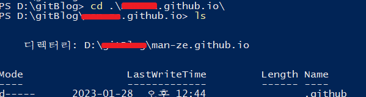
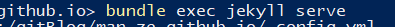
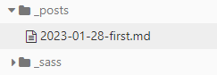
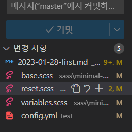
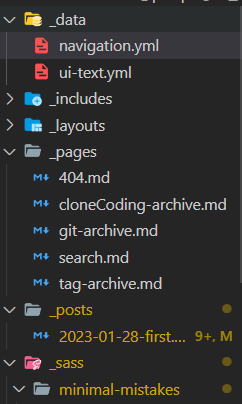
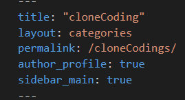

## 시작 동기

해당 블로그의 사용 목적은 크게 두 가지로 이루어진다.

하나는 **깃허브에 익숙해지기**이다.

티스토리를 비롯한 기타 블로그 플랫폼은 사용자가 git 에 대한 이해 없이도 쉽게 접근이 가능하지만,

깃허브 블로그는 개설부터 제법 많은 시간을 잡아먹으며, 마크다운 문법의 이해 없이는 포스팅이 어렵다.

이번 블로그 개설을 계기로 프로그래밍 문법에 대한 이해를 높이고 깃과 깃허브를 자유롭게 다룰 수 있게 되길 바란다.

다음으로는 **프로젝트 관리에 용이**하다는 것이다.

깃허브와 연동되는 이점을 이용하여 프로젝트 후기 등을 올릴 때 타사 블로그 플랫폼에서

작성하기 어려웠던 부분을 조금 더 자유롭게 작성할 수 있음을 기대하는 바이다.

## 설치 과정



테디노트님의 깃허브 블로그 개설 강좌를 참고하여 시작했다.

Jekyll 을 로컬PC 에 설치하지 않아도 가능한 방법으로 안내되어있는 점이 큰 메리트로 작용한다.

실제로 나는 이 강좌를 보기 전까지 Jekyll (+ruby) 설치 하면서 겪은 에러들 때문에 많은 시간을 날려먹었다 😭

## 환경 설정

1. [Jekyll 테마 고르기 (github)](https://github.com/topics/jekyll-theme)

   가장 많은 유저의 선택을 받은 [minimal-mistakes](https://mmistakes.github.io/minimal-mistakes/docs/configuration/) 스킨으로 선택하였다.

2. 선택한 테마를 내 repository에 fork 한 뒤, 해당 repository 이름을 _username.github.io_ 으로 변경해준다.

   (✔ 이 때, username 는 반드시 본인 github 계정 name 과 일치해야한다.)

3. 리파지토리 내에 \_config.yml 에서 블로그 url 및 디자인을 수정할 수 있다.
   url 은 _username.github.io_ 으로 통일한다.

4. git clone 을 하면 vscode 와 마크다운 에디터에서 작업하고, 실시간 수정여부를 확인할 수 있다.

   로컬 PC 에 clone 할 폴더를 생성하고, 생성한 리파지토리를 clone 해준다.

5. 실시간 수정 여부 확인하기

   깃허브 블로그 특성 상 업데이트는 보통 1분 내외로 반영이 된다.
   만약 사용자가 실시간으로 수정이 제대로 되었는지 확인하고 싶다면, 로컬 PC 에 jekyll을 설치할 필요가 있다.
   (단, 수정 여부만 확인하는 것일 뿐 반영은 별도로 push 를 해주어야한다.)

   1. [Ruby installer 설치](https://rubyinstaller.org/downloads/)

   2. powershell 을 열어서 clone 한 경로로 이동하여 아래 명령어 실행.

      - bundle install (Jekyll 설치)

      - **bundle exec jekyll serve (서버 실행)**

   - 서버 실행 명령어를 입력하면 _localhost:4000_ 에서 수정 내역을 확인할 수 있다.
   - 코드를 수정하면 powershell 에서 이전 작업을 취소한 뒤 신규 서버를 로드해야한다.
     ctrl + C → 키보드 방향키 (↑) _(bundle exec jekyll serve 을 의미함)_

   * _cd_ 해당 디렉터리로 이동
   * _ls_ 현재 폴더 목록 조회

## 게시글 올리기

1. \_posts 라는 폴더명으로 리파지토리 하위에 신규 폴더를 별도로 생성하고, 게시 날짜로 확장자 _md_ 문서를 추가한다

   

2. **작성한 포스트 push 하기**

vscode 에서 commit 후 push 하거나, sourcetree 라는 GUI 앱을 사용하여 push 하기도 한다.

✨ 마크다운 에디터로 확인하는것과, 실제로 포스팅되는 페이지는 차이가 있으니 서버에서 확인하면서 게시글을 작성하는것이 좋다.

 모든 게시글 작성이 마무리되었으면, 반드시 commit 후 push 하는 것을 잊지말자.

## 블로그 꾸미기



1. **data - navigation.yml** : 상단바 및 aside 바의 명칭 및 url 지정 가능

2. **\_pages (신규생성)** : 사용자가 추가하는 카테고리 영역

   

 이 블로그의 경우, 상단 메뉴바에 cloneCoding 이라는 카테고리가 있다.

3. **\_posts** : 게시글을 포스팅하는 폴더

4. [\_sass](https://devinlife.com/howto%20github%20pages/github-pages-settings/) : 디자인 영역으로 스킨이나 폰트, 패딩등을 모두 해당 폴더의 하위 페이지에서 수정할 수 있다

- [\_config.yml](https://velog.io/@eona1301/Github-Blog-minimal-mistakes-config.yml-%EC%88%98%EC%A0%95%ED%95%98%EA%B8%B0) : URL, 프로필, 게시글 갯수 등 전반적 디자인에 대한 수정 등
- [카테고리와 태그 수정하기](https://devinlife.com/howto%20github%20pages/category-tag/)

링크된 블로그와 유튜브 등을 참고하여 수정했다.

4. 마크다운 문법의 이해

   Typora 를 사용중이긴 하지만 그래도 기본 md 문법은 알아둬야 할 것 같아

   ①[유용한](https://goddaehee.tistory.com/307) ②[마크다운 문법 정리 사이트](https://gist.github.com/ihoneymon/652be052a0727ad59601)를 첨부한다.

## 끝으로

이 블로그를 만들기 위해 하루가 넘는 시간을 할애했다.

그럼에도 불구하고 아직 초반이라 부족하고 보완해야 할 점이 많다.

차근차근 정성들여 포스팅하다보면 부족했던 부분이 서서히 채워질 것이라 믿는다.
